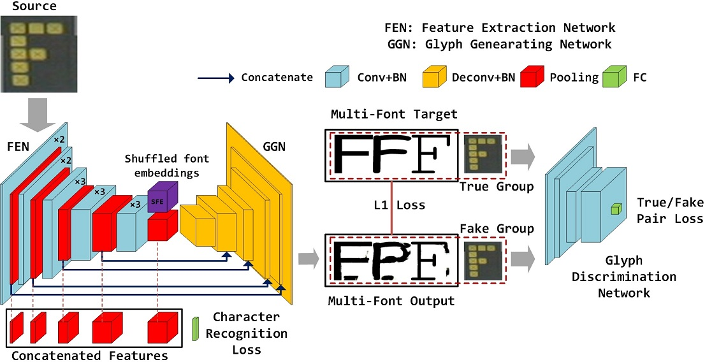

# CGRN: Character Generation and Recognition Network

# Introduction

This is the code of our paper 'Boosting scene character recognition by learning canonical forms of glyphs' accepted by ICDAR-IJDAR Journal Track. The paper can be found here http://arxiv.org/abs/1907.05577.


# Datasets and pretrained VGG model

Download the datasets and pretrained VGG model used in our experiments in this link: https://drive.google.com/open?id=1lVgYBIS48poHGprbYNwdXNwTjyApCcfi

After downloading these files, put 'vgg16_weights.npz' under 'pretrained_vgg', and put 'IIIT5k' and 'ICDAR03' folders under 'experiments'.

# Requirement
- Python 2.7
- Tensorflow >= 1.0.1

# Train
To start training, run the following command:
```sh
python train.py --experiment_dir=./experiments/IIIT5k --experiment_id=0  --batch_size=128   \
                --lr=0.0001  --epoch=200 --schedule=5  --L1_penalty=100 --Lcont_penalty=100 \
                --image_size=64 --fontclass_num=4 --charclass_num=62 \
                --resume=0 --use_bn=1  --checkpoint_steps=192 --gpu_id=0
```

# Test on the fly
During the training, you can run a separate program to repeatedly evaluates the produced checkpoints:
```sh
python test.py --test_obj=./experiments/IIIT5k/data/test.obj \
               --model_dir=./experiments/IIIT5k/checkpoint/experiment_0_batch_128  \
               --fontclass_num=4 --batch_size=256 --charclass_num=62 --use_bn=1 --gpu_id=9
```
In our paper, we reported the best recognition accuracy of all evaluated checkpoints.

# Train with your own data
To train CGRN with your own data, you need to prepare the images as the following format:


where a scene character image is concatenated with glyph images of different fonts along the horizontal direction.
(Note that do not resize the images after concatenation because the interpolation will affect the boundaries of individual images)
Name the images as 'fontclasses_charclass_imgname' (e.g., 0123_0_BadImag-img037-00009.png), where '0123' denotes that the font classes of these glyph images are 0,1,2,3, '0' denotes that the char class of this image is 0 (i.e., a).

Putting all your images into a directory, and run:
```sh
python package.py --dir=image_directory
                  --save_dir=binary_save_directory
                  --split_ratio=[0,1]
```
to pickle the images and their corresponding labels into binary format.

# Some details about the implementation
- Recently we find that the training process will be more stable if we generate glyph image of one randomly picked font in each step.
So we finally adopt this strategy instead of generating glyph images of all fonts in a row, which was introduced in our paper.
- During each step, we first optimize the discriminator once, then optimize the geneator twice, which is helpful for the convergence of the whole model.
- The learning rate markedly affects the recognition accuracy. Empirically, we find 0.0001 and 0.0002 are the best learning rates for IIIT5k and ICDAR03, respectively.
- The font embeddings were randomly initialized and remains none-trainable in our paper. However, some bad initializations may lead CGRN to poor performance. To prevent this situation, font embeddings are added into trainable variables in this code. It will be a very interesting work to investigate the design of font embeddings.

# Citation

If you find this project helpful for your research, please cite the following paper:
```
@article{wang2019boosting,
  title={Boosting scene character recognition by learning canonical forms of glyphs},
  author={Wang, Yizhi and Lian, Zhouhui and Tang, Yingmin and Xiao, Jianguo},
  journal={International Journal on Document Analysis and Recognition (IJDAR)},
  pages={1--11},
  year={2019},
  publisher={Springer}
}
```
# Acknowledgements
Code derived from:

* [pix2pix-tensorflow](https://github.com/yenchenlin/pix2pix-tensorflow) by [yenchenlin](https://github.com/yenchenlin)
* [Domain Transfer Network](https://github.com/yunjey/domain-transfer-network) by [yunjey](https://github.com/yunjey)
* [ac-gan](https://github.com/buriburisuri/ac-gan) by [buriburisuri](https://github.com/buriburisuri)
* [dc-gan](https://github.com/carpedm20/DCGAN-tensorflow) by [carpedm20](https://github.com/carpedm20)
* [origianl pix2pix torch code](https://github.com/phillipi/pix2pix) by [phillipi](https://github.com/phillipi)
* [zi2zi](https://github.com/kaonashi-tyc/zi2zi/) by [kaonashi-tyc](https://github.com/kaonashi-tyc)